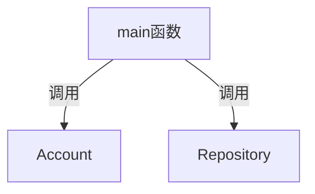

# <center>Bookstore-2025 总体设计文档

#### <center>作者：胡同语（InfinityHty）

## 1.程序功能概述
书店管理系统通过命令行与用户进行交互，能够管理不同权限的用户。不同权限的用户可以通过输入指令对库存书籍进行指定操作。其中店主还可以通过该系统查看运行日志，达到书店管理需求。
## 2.主体逻辑说明


## 3.代码文件结构
main函数处理命令行指令，进入不同分支。main函数通过调用Account，Repository类里面封装的函数，实现对于账户和图书的操作。
调用Log类封装的函数，实现查询日志的操作。
Account类，Repository类的成员函数调用DataMap类，Memory类实现用户信息的读写查询修改等。
## 4.功能设计

## 5.数据库设计
账户管理数据库：由于每个账户拥有不重复的UserID，存储时将UserID作为index，User结构体作为value，利用DataMap存入文件。
（此处2个文件）

书籍管理数据库：由于每本书的检索指标较多，可以给每个ISBN号对应的书分配一个BookID。

数据库分为两部分，一部分是BookID到Book结构体的映射
（此处1个文件）
另一部分以搜索关键词（包括ISBN、BookName、Author、Keyword）为index，BookID为value
构建4张map，分别表示ISBN到BookID，BookName到BookID，Author到BookID，Keyword到BookID的映射
map的结构采用块状链表实现（这里有8个文件）

日志记录数据库：按操作顺序把每条操作记录封装成Record结构体，直接存入一个文件
## 6.类、结构体设计
#### User类
封装了用户的个人信息，包括UserID，UserName，Password，Privilege
作为一个整体写入文件
结构体封装情况如下：
```
class User {
public:
    int UserID;
    char Username[35];
    char Password[35];
    int Privilege;
    User();
    User(char User_name[35], char Password_[35],int privilege = 0, int User_ID = 0): UserID(User_ID), Privilege(privilege){
        Username = User_name;
        Password = Password_;
    }
};
```
#### Account类
提供管理账户的函数接口给main函数，并封装了登录状态栈
Account类通过调用DataMap获取用户信息
```
class Account {
public:
    void AddNewAccount(User user);
    void LogIn(User user);
    User GetUser(int id);
    bool LogOut();
    bool FindUser(int id);
    int GetLoginNumber() {
        return login_number;
    }
private:
    std::string filename = "account.txt";
    std::stack<User> LogInList;
    int login_number = 0;
};
```
#### DataMap类
实现外存上键和值的对应，用于用户的查找，书籍的查找

#### Book类
封装一本书的所有信息

#### Repository类
提供管理图书的函数接口给main函数

#### Record类
封装一条操作记录信息
## 7.补充说明


